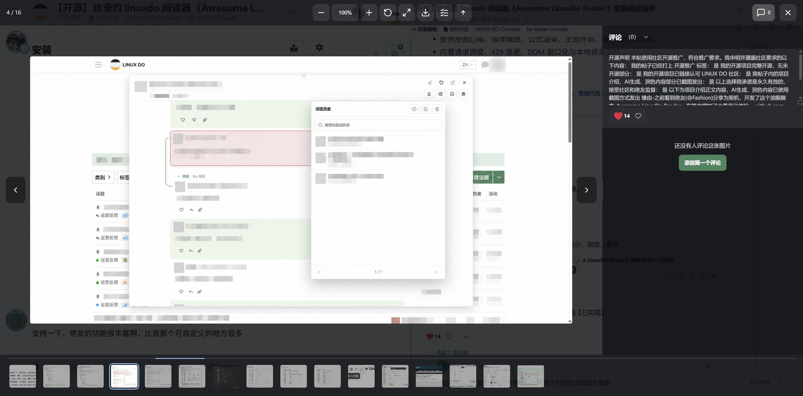
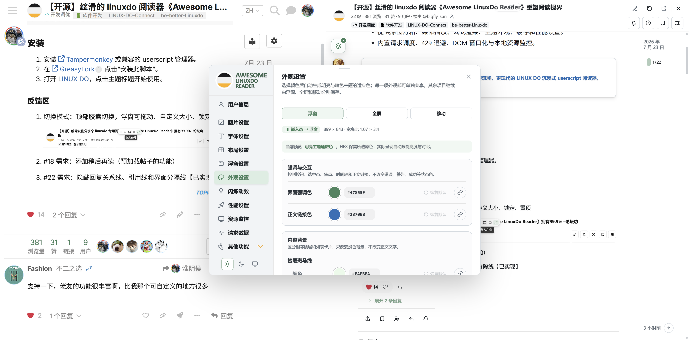
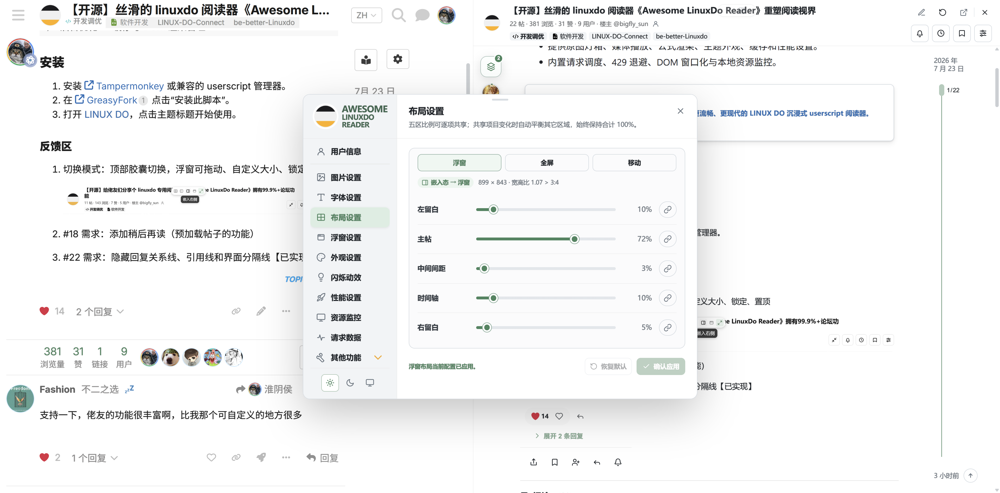
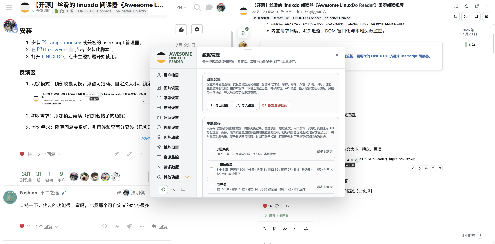

<p align="center">
  
</p>

<h1 align="center">Awesome LinuxDo Reader</h1>

<p align="center">面向 LINUX DO 的沉浸式增强阅读器，在不离开列表页的情况下完成阅读、回复与社区互动。</p>

<p align="center">
  <a href="https://update.greasyfork.org/scripts/588185/Awesome%20LinuxDo%20Reader.user.js">安装脚本</a> ·
  <a href="https://greasyfork.org/zh-CN/scripts/588185-awesome-linuxdo-reader">GreasyFork</a> ·
  <a href="work/main.js">脚本源码</a> ·
  <a href="https://sunbigfly.github.io/awesome-linuxdo-reader/">在线用户手册</a> ·
  <a href="docs/INTRODUCTION.md">项目介绍</a> ·
  <a href="CONTRIBUTING.md">参与开发</a> ·
  <a href="LICENSE">MIT License</a>
</p>

<p align="center">
  <a href="assets/screenshots/guide-01-reader-overview.png">
    
  </a>
</p>

<p align="center"><sub>在列表页内完成阅读、追踪上下文与社区互动</sub></p>

## 功能

- 列表页直接打开完整帖子，支持浮窗、全屏与移动端布局。
- 保留楼层关系、楼中楼、跳转、浏览历史与真实已读进度。
- 集成回复、点赞、回应、收藏、通知、搜索与用户资料等社区能力。
- 提供原图灯箱、媒体播放、公式渲染、主题外观、缓存和性能设置。
- 内置请求调度、429 退避、DOM 窗口化与本地资源监控。

## 核心体验

<table>
  <tr>
    <th width="33%">看图灯箱</th>
    <th width="33%">消息中心</th>
    <th width="33%">请求流与 429 控制</th>
  </tr>
  <tr>
    <td><a href="assets/screenshots/guide-19-image-lightbox.png"></a></td>
    <td><a href="assets/screenshots/guide-15-notifications-replies.png"></a></td>
    <td><a href="assets/screenshots/guide-11-request-flow.png"></a></td>
  </tr>
  <tr>
    <td>原图、图片序列与关联评论。</td>
    <td>回复、点赞、私信与内容回跳。</td>
    <td>共享账本、排队放行与退避恢复。</td>
  </tr>
</table>

## 更多截图

以下图片由 Chrome DevTools 在真实 LINUX DO 页面重新采集，保留当时的公开界面、账号和状态信息，未额外打码。点击分组展开，点击图片查看原图。

<details>
<summary><strong>阅读流转</strong> — 工作区与楼中楼上下文</summary>

<table>
  <tr>
    <th width="50%">阅读器工作区</th>
    <th width="50%">楼中楼上下文</th>
  </tr>
  <tr>
    <td><a href="assets/screenshots/guide-01-reader-overview.png"></a></td>
    <td><a href="assets/screenshots/guide-18-thread-context.png"></a></td>
  </tr>
</table>
</details>

<details>
<summary><strong>社区互动</strong> — 浏览历史、收藏与回应</summary>

<table>
  <tr>
    <th width="50%">浏览历史</th>
    <th width="50%">收藏与回应</th>
  </tr>
  <tr>
    <td><a href="assets/screenshots/guide-16-history.png"></a></td>
    <td><a href="assets/screenshots/guide-17-bookmarks-reactions.png"></a></td>
  </tr>
</table>
</details>

<details>
<summary><strong>个性化</strong> — 用户信息、外观与布局</summary>

<table>
  <tr>
    <th width="33%">用户信息</th>
    <th width="33%">外观设置</th>
    <th width="33%">布局设置</th>
  </tr>
  <tr>
    <td><a href="assets/screenshots/guide-02-settings-overview.png"></a></td>
    <td><a href="assets/screenshots/guide-07-appearance-settings.png"></a></td>
    <td><a href="assets/screenshots/guide-05-layout-settings.png"></a></td>
  </tr>
</table>
</details>

<details>
<summary><strong>后台优化</strong> — 缓存与 DOM 渲染管理</summary>

<table>
  <tr>
    <th width="50%">缓存管理</th>
    <th width="50%">DOM 渲染管理</th>
  </tr>
  <tr>
    <td><a href="assets/screenshots/guide-13-data-management.png"></a></td>
    <td><a href="assets/screenshots/guide-09-performance-settings.png"></a></td>
  </tr>
</table>
</details>

## 安装

1. 安装 [Tampermonkey](https://www.tampermonkey.net/) 或兼容的 userscript 管理器。
2. 在 [GreasyFork](https://greasyfork.org/zh-CN/scripts/588185-awesome-linuxdo-reader) 点击“安装此脚本”。
3. 打开 [LINUX DO](https://linux.do/)，点击主题标题开始使用。

当前项目版本为 `0.1.4`，脚本仅匹配 `https://linux.do/*`。

## 开发

`work/main.js` 是唯一业务源码。仓库不使用构建产物作为开发入口，调试、校验和发布都从该文件开始。

```text
.
├── .github/          GitHub 协作模板
├── assets/           品牌与文档资源
├── docs/             项目介绍和资料索引
├── scripts/          跨平台开发工具入口
├── tools/            Rust 开发辅助工具源码
├── work/main.js      userscript 唯一业务源码
├── CONTRIBUTING.md   开发与验证规范
├── LICENSE           MIT 许可证
└── README.md         项目入口
```

本地开发与验证流程见 [CONTRIBUTING.md](CONTRIBUTING.md)。

## 用户手册

直接打开 [在线用户手册](https://sunbigfly.github.io/awesome-linuxdo-reader/) 即可浏览，无需安装本项目、下载文档或运行本地服务。手册覆盖安装、阅读导航、社区互动、图片与媒体、全部设置、缓存、请求治理、隐私和故障排查。

功能覆盖目录位于 [`docs/public/feature-catalog.json`](docs/public/feature-catalog.json)。每项用户可见能力都有稳定 `feature_id`、源码锚点、版本、验证日期、截图和对应文档；修改用户功能时必须同步更新。

## 许可

本项目基于 [MIT License](LICENSE) 开源。
