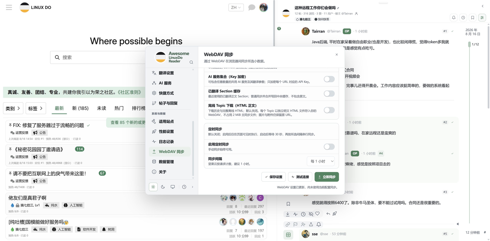

<p align="center">
  
</p>

<h1 align="center">Awesome LinuxDo Reader</h1>

<p align="center"><strong>把 Discourse 从帖子列表，变成完整的阅读工作区。</strong></p>

<p align="center">
  在一个连续界面中完成长帖阅读、上下文追踪、跨语翻译、原站互动与资料整理。<br>
  为 LINUX DO 深度定制，也适用于标准 HTTPS Discourse 社区。
</p>

<p align="center">
  <a href="https://greasyfork.org/zh-CN/scripts/588185-awesome-linuxdo-reader"><strong>安装脚本</strong></a>
  ·
  <a href="https://sunbigfly.github.io/awesome-linuxdo-reader/">用户手册</a>
  ·
  <a href="https://sunbigfly.github.io/awesome-linuxdo-reader/reference/feature-catalog">功能目录</a>
  ·
  <a href="CONTRIBUTING.md">参与开发</a>
</p>

<p align="center"><sub>Lite 1.5.8 · TypeScript · MIT License · Tampermonkey</sub></p>

<p align="center">
  <a href="assets/screenshots/guide-01-reader-overview-v1.5.0.png">
    
  </a>
</p>

## 为长内容重新设计 Discourse 阅读体验

Awesome LinuxDo Reader 不是独立论坛，也不替代原站。它在保留当前账号、权限和内容来源的前提下，为主题列表增加一个完整阅读工作区，让阅读、定位、回复和整理资料不再依赖频繁跳页。

LINUX DO 是完整功能基线。对于其他标准 Discourse 社区，阅读器会根据站点运行态和插件能力自动适配；站点没有 Boost、Reactions 或 Topic Voting 时，相应入口会自然隐藏。

## 核心能力

<table>
  <tr>
    <td width="50%" valign="top">
      <h3>连续阅读工作区</h3>
      <p>在浮窗、全屏、左右嵌入或移动布局中直接阅读完整主题。长帖按需渲染，多主题队列、历史前后切换和真实已读进度保持连续。</p>
    </td>
    <td width="50%" valign="top">
      <h3>完整讨论上下文</h3>
      <p>还原楼中楼、父回复、引用来源和无限讨论树；支持只看楼主、已解决答案、时间轴、目标楼层高亮与跨 Topic 回跳。</p>
    </td>
  </tr>
  <tr>
    <td width="50%" valign="top">
      <h3>原站级互动</h3>
      <p>回复、划词引用、点赞、表情回应、Boost、收藏、通知、分享、编辑和举报继续使用原站 API、账号状态与权限判断。</p>
    </td>
    <td width="50%" valign="top">
      <h3>共享工具工作区</h3>
      <p>通知与私信、浏览历史、收藏与回应、Topic 下载、用户观察、岁月史书和不想看集中到可冻结的多标签浮窗。</p>
    </td>
  </tr>
  <tr>
    <td width="50%" valign="top">
      <h3>富内容与跨语阅读</h3>
      <p>覆盖原图灯箱、图片评论、批量下载、音视频、HLS、KaTeX、投票与代码工具；支持原文、双语、全译文和自定义 OpenAI 兼容翻译服务。</p>
    </td>
    <td width="50%" valign="top">
      <h3>可控的数据与性能</h3>
      <p>提供离线 Topic、WebDAV 分类同步、设置导入导出、缓存治理、请求诊断、429 退避、长帖虚拟化和资源监控。</p>
    </td>
  </tr>
</table>

完整的 110 项用户可见能力、适用范围和对应说明见[功能覆盖目录](https://sunbigfly.github.io/awesome-linuxdo-reader/reference/feature-catalog)。

## 产品界面

<table>
  <tr>
    <td width="33%" align="center" valign="top">
      <a href="assets/screenshots/guide-18-thread-context-v1.5.0.png">
        
      </a>
      <br><strong>理解讨论关系</strong><br>
      <sub>父回复、引用回跳与楼层上下文</sub>
    </td>
    <td width="33%" align="center" valign="top">
      <a href="assets/screenshots/guide-31-topic-download-v1.5.0.png">
        
      </a>
      <br><strong>保留重要内容</strong><br>
      <sub>按范围生成可搜索的离线 Topic</sub>
    </td>
    <td width="33%" align="center" valign="top">
      <a href="assets/screenshots/guide-32-webdav-sync-v1.5.0.png">
        
      </a>
      <br><strong>同步由你决定</strong><br>
      <sub>按数据类别独立启用 WebDAV</sub>
    </td>
  </tr>
</table>

## 从打开主题到完成阅读

1. **留在主题列表**：点击标题后，阅读器在当前页面打开主题，不打断列表浏览状态。
2. **沿上下文阅读**：通过时间轴、楼层关系、只看楼主、历史导航和多主题队列持续推进。
3. **直接完成互动**：回复、点赞、收藏和其他社区动作提交到当前原站。
4. **按需整理内容**：把重要主题加入收藏、阅读队列、离线 Topic 或可选的 WebDAV 同步类别。

## 适合这些场景

- 每天在 LINUX DO 或其他 Discourse 社区跟进大量主题。
- 阅读数百楼的长帖，需要随时确认引用、父回复和讨论分支。
- 在中文与非中文社区之间切换，希望保留原文并快速获得双语内容。
- 集中处理通知、私信、收藏、用户动态和历史内容。
- 需要离线保存重要主题，或在多设备间同步自己选择的阅读数据。

## 兼容范围

| 场景 | 支持方式 |
| --- | --- |
| LINUX DO | 深度适配，作为完整功能基线 |
| 内置社区 | 预置 20 个常用 Discourse 社区 |
| 其他标准 Discourse | 在 HTTPS 页面通过运行态与 DOM 证据自动识别 |
| 站点插件 | 按实际能力显示 Reactions、Boost、Topic Voting 等入口 |
| 桌面与移动端 | 支持浮窗、嵌入、全屏和移动布局 |

详细站点列表、浏览器要求与功能差异见[兼容性说明](https://sunbigfly.github.io/awesome-linuxdo-reader/reference/compatibility)。

## 数据与安全边界

- **原站优先**：账号、权限、帖子、消息、收藏和互动结果始终以当前 Discourse 原站为准。
- **本地优先**：设置、阅读状态和缓存默认保存在当前浏览器；WebDAV 默认关闭。
- **主动同步**：只有用户配置 WebDAV 并选择具体类别后，阅读器才访问对应远端。
- **秘密隔离**：设置导出不会包含翻译 API Key、WebDAV 用户名或密码；导入失败会回滚已应用内容。
- **透明诊断**：请求、429、Cloudflare、缓存和资源状态可以脱敏查看，不导出 Cookie 或 Authorization。

更多说明见[隐私、权限与数据边界](https://sunbigfly.github.io/awesome-linuxdo-reader/manage/privacy-and-permissions)。

## 开始使用

当前项目版本为 `1.5.8`。

1. 安装 [Tampermonkey](https://www.tampermonkey.net/) 或兼容的 userscript 管理器。
2. 前往 [Greasy Fork](https://greasyfork.org/zh-CN/scripts/588185-awesome-linuxdo-reader) 安装 **Awesome LinuxDo Reader**。
3. 打开或刷新 LINUX DO、内置社区或其他标准 HTTPS Discourse 页面。
4. 在主题列表点击标题，开始使用增强阅读工作区。

> 普通用户只需安装主脚本，不需要单独安装项目 Library。正式版、本地调试版和其他同类接管脚本不要同时启用。

## 深入了解

| 内容 | 入口 |
| --- | --- |
| 五分钟上手 | [快速开始](https://sunbigfly.github.io/awesome-linuxdo-reader/getting-started/quick-start) |
| 完整功能清单 | [功能覆盖目录](https://sunbigfly.github.io/awesome-linuxdo-reader/reference/feature-catalog) |
| 设置与数据管理 | [设置中心](https://sunbigfly.github.io/awesome-linuxdo-reader/settings/overview) |
| WebDAV 同步 | [WebDAV 同步](https://sunbigfly.github.io/awesome-linuxdo-reader/settings/webdav-sync) |
| 常见问题 | [故障排查](https://sunbigfly.github.io/awesome-linuxdo-reader/manage/troubleshooting) |
| 版本变化 | [更新记录](https://sunbigfly.github.io/awesome-linuxdo-reader/reference/changelog) |

<details>
<summary><strong>面向开发者</strong></summary>

Lite 阅读器以以下目录为事实源：

- `lite/src/`：TypeScript 业务源码；
- `lite/styles/`：阅读器样式；
- `lite/userscript.meta.txt`：userscript 元数据。

生成本地单文件与四文件审查入口：

```bash
npm run main-lite:local-debug
```

开发规范、验证要求和提交约定见 [CONTRIBUTING.md](CONTRIBUTING.md)。

</details>

## License

[MIT License](LICENSE)
