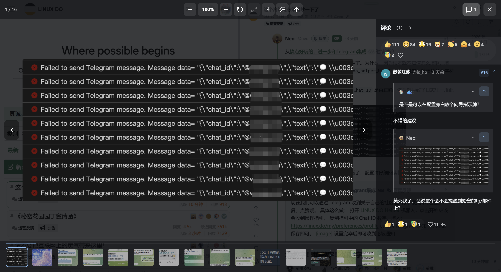

<p align="center">
  
</p>

<h1 align="center">Awesome LinuxDo Reader</h1>

<p align="center">为 LINUX DO 深度定制并保持完整功能覆盖，同时通过站点识别与能力检测兼容中文、英文及其他语言的标准 Discourse 社区，在列表页内完成阅读、翻译、回复与原站互动。</p>

<p align="center">
  <a href="https://update.greasyfork.org/scripts/588185/Awesome%20LinuxDo%20Reader.user.js">安装脚本</a> ·
  <a href="https://greasyfork.org/zh-CN/scripts/588185-awesome-linuxdo-reader">GreasyFork</a> ·
  <a href="lite/src/userscript/mian-lite-entry.ts">Lite 源码</a> ·
  <a href="https://sunbigfly.github.io/awesome-linuxdo-reader/">在线用户手册</a> ·
  <a href="docs/INTRODUCTION.md">项目介绍</a> ·
  <a href="CONTRIBUTING.md">参与开发</a> ·
  <a href="LICENSE">MIT License</a>
</p>

<p align="center">
  <a href="assets/screenshots/guide-01-reader-overview-v1.0.0.png">
    
  </a>
</p>

<p align="center"><sub>在列表页内完成阅读、追踪上下文与社区互动</sub></p>

## 功能

- LINUX DO 全面适配，消息、历史、收藏、回应、Boost、长帖与楼层关系等能力保持完整覆盖。
- 中文、英文及其他语言的标准 Discourse 站点均可使用；插件、主题和权限差异由站点适配层与能力检测自动降级。
- 列表页直接打开完整帖子，支持浮窗、全屏与移动端布局。
- 保留楼层关系、楼中楼、跳转、浏览历史与真实已读进度。
- 集成回复、点赞、回应、收藏、通知、搜索与用户资料等社区能力。
- 为非中文内置社区提供原文、双语与全译文切换，并集成原图灯箱、媒体播放和公式渲染。
- 内置 21 个社区；其他 HTTPS Discourse 论坛可验证后添加，非 Discourse 网站不会启动。
- 内置请求调度、429 退避、DOM 窗口化与本地资源监控。

## 核心体验

<table>
  <tr>
    <th width="33%">看图灯箱</th>
    <th width="33%">消息中心</th>
    <th width="33%">请求流与 429 控制</th>
  </tr>
  <tr>
    <td><a href="assets/screenshots/guide-19-image-lightbox-v1.0.0.png"></a></td>
    <td><a href="assets/screenshots/guide-15-notifications-replies-v1.0.0.png"></a></td>
    <td><a href="assets/screenshots/guide-11-request-flow-v1.0.0.png"></a></td>
  </tr>
  <tr>
    <td>原图、图片序列与关联评论。</td>
    <td>回复、点赞、私信与内容回跳。</td>
    <td>共享账本、排队放行与退避恢复。</td>
  </tr>
</table>

## 更多截图

以下图片由 Chrome DevTools 在真实 LINUX DO 页面重新采集，保留当时的公开界面、账号和状态信息，未额外打码。点击分组展开，点击图片查看原图。

<details>
<summary><strong>阅读流转</strong> — 工作区与楼中楼上下文</summary>

<table>
  <tr>
    <th width="50%">阅读器工作区</th>
    <th width="50%">楼中楼上下文</th>
  </tr>
  <tr>
    <td><a href="assets/screenshots/guide-01-reader-overview-v1.0.0.png"></a></td>
    <td><a href="assets/screenshots/guide-18-thread-context-v1.0.0.png"></a></td>
  </tr>
</table>
</details>

<details>
<summary><strong>社区互动</strong> — 浏览历史、收藏与回应</summary>

<table>
  <tr>
    <th width="50%">浏览历史</th>
    <th width="50%">收藏与回应</th>
  </tr>
  <tr>
    <td><a href="assets/screenshots/guide-16-history-v1.0.0.png"></a></td>
    <td><a href="assets/screenshots/guide-17-bookmarks-reactions-v1.0.0.png"></a></td>
  </tr>
</table>
</details>

<details>
<summary><strong>个性化</strong> — 用户信息、外观与布局</summary>

<table>
  <tr>
    <th width="33%">用户信息</th>
    <th width="33%">外观设置</th>
    <th width="33%">布局设置</th>
  </tr>
  <tr>
    <td><a href="assets/screenshots/guide-02-settings-overview-v1.0.0.png"></a></td>
    <td><a href="assets/screenshots/guide-07-appearance-settings-v1.0.0.png"></a></td>
    <td><a href="assets/screenshots/guide-05-layout-settings-v1.0.0.png"></a></td>
  </tr>
</table>
</details>

<details>
<summary><strong>后台优化</strong> — 缓存与 DOM 渲染管理</summary>

<table>
  <tr>
    <th width="50%">缓存管理</th>
    <th width="50%">DOM 渲染管理</th>
  </tr>
  <tr>
    <td><a href="assets/screenshots/guide-13-data-management-v1.0.0.png"></a></td>
    <td><a href="assets/screenshots/guide-09-performance-settings-v1.0.0.png"></a></td>
  </tr>
</table>
</details>

## 安装

> **发布状态：** GitHub 源码、用户手册与 Greasy Fork 脚本 588185 均已发布 Lite `1.0.0`。正式主脚本是 3,794 字节薄 Loader，固定加载 Core `1895870` 与 Features `1895872`；两个 Library 均带已核验的 SHA-256。

1. 安装 [Tampermonkey](https://www.tampermonkey.net/) 或兼容的 userscript 管理器。
2. 在 [GreasyFork](https://greasyfork.org/zh-CN/scripts/588185-awesome-linuxdo-reader) 点击“安装此脚本”。
3. 打开或刷新以下任一站点：
   - [LINUX DO](https://linux.do/)
   - [Brave Community](https://community.brave.com/)
   - [Roblox Developer Forum](https://devforum.roblox.com/)
   - [OpenAI Developer Community](https://community.openai.com/)
   - [Home Assistant Community](https://community.home-assistant.io/)
   - [Cfx.re Forum](https://forum.cfx.re/)
   - [Spiceworks Community](https://community.spiceworks.com/)
   - [Arduino Forum](https://forum.arduino.cc/)
   - [Unity Discussions](https://discussions.unity.com/)
   - [Cloudflare Community](https://community.cloudflare.com/)
   - [Epic Developer Community](https://forums.unrealengine.com/)
   - [Obsidian Forum](https://forum.obsidian.md/)
   - [Cursor Community](https://forum.cursor.com/)
   - [Godot Forum](https://forum.godotengine.org/)
   - [n8n Community](https://community.n8n.io/)
   - [MikroTik Forum](https://forum.mikrotik.com/)
   - [Discourse Meta](https://meta.discourse.org/)
   - [Python Discussions](https://discuss.python.org/)
   - [Swift Forums](https://forums.swift.org/)
   - [Julia Discourse](https://discourse.julialang.org/)
   - [Rust Users Forum](https://users.rust-lang.org/)
4. 其他 HTTPS Discourse 论坛可在阅读器“设置 → 适用站点 → 其他适用站点”中验证并添加。
5. 点击主题标题开始使用。

当前项目版本为 `1.0.0`。脚本对 LINUX DO 保持全面适配，同时兼容中文、英文及其他语言的标准 Discourse 社区；其他 HTTPS Discourse 论坛可验证后添加。除内置中文站点 LINUX DO 外，其他内置社区和语言未知的自定义 Discourse 站点还支持原文、双语和简体中文译文切换；完整范围、翻译边界和能力降级规则见[兼容性说明](https://sunbigfly.github.io/awesome-linuxdo-reader/reference/compatibility)。

1.0.0 重点完成 Lite 模块化重构：业务逻辑、生命周期、请求、缓存与界面组件改由 TypeScript 模块维护；Greasy Fork 发布使用薄主 Loader 加两个可审查 Library，避开单文件 2 MB 上限且不压缩、不混淆。完整列表见[更新记录](https://sunbigfly.github.io/awesome-linuxdo-reader/reference/changelog)。

## 开发

v1.0.0 起，`lite/src/` 是唯一业务源码，`lite/styles/` 是样式事实源。`work/mian-lite.css`、`work/greasyfork-lite/libraries/` 与最终的 `work/mian-lite.js` 都是确定性发布产物，禁止直接编辑。Greasy Fork 只接收可读、未压缩的薄 Loader 和两个 Library；正式 Loader 通过固定版本 URL 与 SHA-256 引用 Library。切换前的旧版 working copy 保存在 `archive/legacy-main-2026-08-07/`，原 `work/main.js` 与 `work/main.css` 仅作旧版兼容参考。

### 三条保留产物

| 版本 | 保留内容 | 是否进入 GitHub | 用途 |
| --- | --- | --- | --- |
| GitHub 原版 | `lite/src/`、`lite/styles/`、测试、构建脚本、文档与可审查生成物 | 是 | 唯一源码事实源和完整开发历史 |
| 本地测试版 | `work/mian-lite.local.js`、`work/local-debug.user.js`、`work/v1.0.0-acceptance.user.js` | 否，受 `.gitignore` 保护 | Tampermonkey 真实页面调试与 v1.0.0 截图验收 |
| Greasy Fork 上传版 | `work/mian-lite.js` 薄 Loader、两个 Library 和 `work/mian-lite.css` | 是 | 通过发布门禁后由主脚本加载固定版本 Library |

三条产物不会互相覆盖：本地测试版只从当前工作区加载；Greasy Fork Library 从
GitHub Raw `main` 通过 Webhook 同步；用户只安装主脚本，不需要单独安装 Library。
正式 Loader 必须在静态检查、真实浏览器、性能和回滚门禁都完成后生成和发布。

```text
.
├── .github/          GitHub 协作模板
├── assets/           品牌与文档资源
├── docs/             项目介绍和资料索引
├── dist/             仓库直装的压缩 userscript 与来源清单
├── lite/             v1.0.0 TypeScript 业务源码、样式、契约与测试
├── scripts/          跨平台开发工具入口
├── tools/            Rust 开发辅助工具源码
├── work/greasyfork-lite/  Lite Greasy Fork Library 发布产物
├── archive/legacy-main-2026-08-07/  旧版 main.js/main.css 只读归档
├── CONTRIBUTING.md   开发与验证规范
├── LICENSE           MIT 许可证
└── README.md         项目入口
```

本地开发与验证流程见 [CONTRIBUTING.md](CONTRIBUTING.md)。

## 用户手册

直接打开 [在线用户手册](https://sunbigfly.github.io/awesome-linuxdo-reader/) 即可浏览，无需安装本项目、下载文档或运行本地服务。手册覆盖安装、阅读导航、社区互动、图片与媒体、全部设置、缓存、请求治理、隐私和故障排查。

功能覆盖目录位于 [`docs/public/feature-catalog.json`](docs/public/feature-catalog.json)。每项用户可见能力都有稳定 `feature_id`、源码锚点、版本、验证日期、截图和对应文档；修改用户功能时必须同步更新。

## 许可

本项目基于 [MIT License](LICENSE) 开源。
